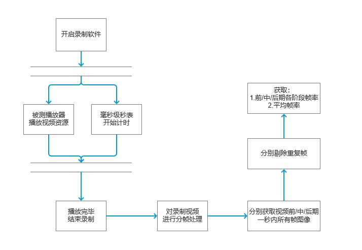
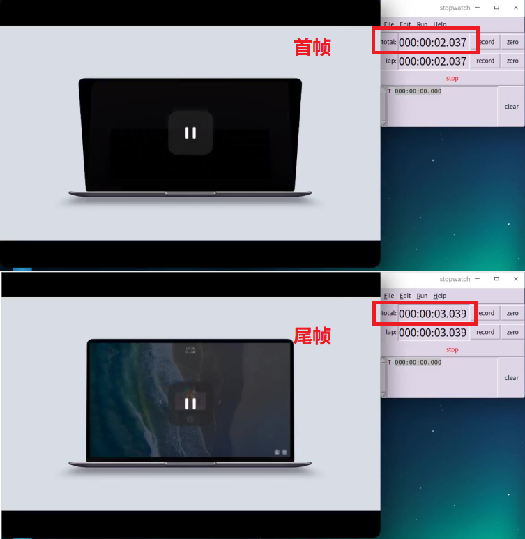
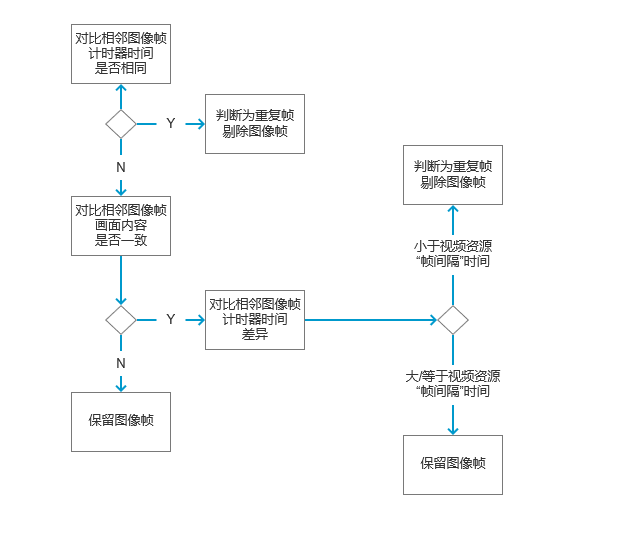

# 基于视频播放器获取播放中视频资源FPS的测试技术交底书                     

## 0、缩略语和关键术语定义


|  **名词** |  **全称**|**描述**|
| :------------- | :-------------- | :---------------|
|  帧       |  Frame          |     一帧就是一幅静止的画面，连续的帧就形成动画|
|  FPS      |  Frames Per Second  | 帧率（每秒传输帧数）|


## 1、相关技术背景（背景技术），与本发明最相近似的现有实现方案（现有技术）

现代多媒体资源日益复杂，视频播 	放器播放视频资源最终呈现的效果存在各种差异，FPS是一项重要指标，若播放视频资源时FPS异常，用户可以直接的感受到。比如通过播放器播放一个50FPS的视频资源，通过显示器呈现出来只有40FPS，每秒存在10帧的差距，那么用户在观感上能察觉到视频播放卡顿、不连贯。

本专利主要测试对象是针对视频播放器，测试视频资源通过播放器播放，是否达到视频资源预期FPS的新测试技术。

目前行业内有多种测试方法：

1. 主观法：用户视觉，使用肉眼观察。这种方法只能测试出偏差较大的情况，精准度较低。

2. 专用设备：市面上有一些针对此场景的专用测试设备，比如"秒发生器"，该设备可以通过配套的摄像机检测出播放视频的FPS，且精准度有一定保证。

3. 设备辅助与计算：通过高速相机（每秒可捕捉1000-10000帧）录制视频，通过一定的算法得出播放视频的FPS。

### 1.1、与本发明相关的现有技术一

#### 1.1.1、现有技术一的技术方案

通过主观法来进行测试，只需要通过被测播放器播放不同的视频，通过肉眼进行观测，在播放过程中是否流程，是否出现卡顿、画面不连贯等问题。该方法测试起来全靠测试人员的经验，测试效率较高。

#### 1.1.2、现有技术一的缺点

使用方案一进行测试，适用于精度要求不高的测试场景，比如只需要保证播放功能可用，播放视频流畅即可。但是需要获得具体测试数据，做更近一步的分析时，该方法则无法满足。

### 1.2、与本发明相关的现有技术二

#### 1.2.1、现有技术二的技术方案

使用针对该场景生产的专用设备来进行测试，例如"秒发生器"，设备分为两部分：图像工作站、专用摄像头。

原理是通过被测播放器播放视频资源，然后使用设备开始录制视频，录制时间需要大于等于120秒；通过图形工作站软件对视频录像进行单帧回放，前后两帧图片显示秒发生器中LED位置有差异即记为一帧，回放时间应大于等于120s；随机选取一段20s时长的视频录像，设备内部会自动计算出20s内包含的图像帧数值N,按以下公式计算出帧率数值：

#### 1.2.2、现有技术二的缺点

通过专用设备进行测试得出的数值精度较高，缺点也很明显，就是是对设备很依赖，如果需要到其他地点进行测试，则携带起来较为不便；甚至如果设备故障，又急需测试时，还会耽误测试进度；除此之外若视频时长小于120s则不可测试，当然采购设备也是一笔不小的开销。

### 1.3、与本发明相关的现有技术三

#### 1.3.1、现有技术三的技术方案

设备辅助与计算的方法，其实是一种半手工测试方法，同样需要依赖设备"高速相机"。原理是通过被测播放器播放视频资源，然后使用高速相机对整个播放视频进行录制，因为高速相机的特点，可以捕获到播放视频中每一帧的变化。视频录制结束后需要获取几个值：

1. 总帧数：录制视频中所有帧数量

2. 总掉帧数：录制视频中所有重复帧数量

3. 每秒总帧数：录制视频中某一秒时间内所有帧数量

取得以上数值后根据以下公式进行运算，获得"掉帧率"从而计算出"帧率值（FPS）"：
```
掉帧率 = 总掉帧数/总帧数*100%
帧率=每秒总帧数*（1-掉帧率）
```


#### 1.3.2、现有技术三的缺点

通过该方案计算的的帧率相对于技术一更为精准的多，和方案二不相上下。因为都是通过比例值运算得出的数值，最终结论都是平均FPS，但是针对视频某一段、某一秒时任然会存在差异。除此之外，因为依赖高速相机，所以同样会面临技术二所面临的问题。

## 2、本发明技术方案的详细阐述

### 2.1、本发明所要解决的技术问题

本发明主要解决以下技术问题：

1. 针对现有技术方案，提升其测试结果精准度

2. 不依赖外部设备，适用性与易用性高

### 2.2、本发明提供的完整技术方案

为了解决上述技术问题，本发明提供了一种帧率测试方法，能提高测试的准确性和通用性，具体的流程如下：



> 图1：测试方案流程图

**准备工作：**

1. 视频资源：例如30FPS视频、45FPS视频\...

2. 录制工具：能调节录制视频FPS即可

3. 计时工具：毫秒级即可

4. 视频分解工具：此处使用了1个自研测试辅助工具（PerfTools）实现
   
   以上工具市面上满足要求的很多，就不多做介绍了，这里也说明了该方案的通用性，无需使用一些造价不菲的外部设备。
   
   **方案设计流程：**


1. 确认即将播放的视频资源FPS，启动录制工具，此时需要注意的是设置录制FPS值，必须高于视频资源FPS，才能确保完整捕获到视频资源的每一帧。

2. 启动毫秒级计时工具，此处加入该设计有两个目的（后面会细说）：


(1) 协助判断重复帧

(2) 协助计算帧率


3. 被测播放器开始播放视频资源，与此同时计时器与录制工具运行中。

4. 视频播放完毕，关闭播放器/计时器，结束录制并导出视频。

5. 使用PerfTools工具对视频进行分解处理，工具可以把视频分解成图像帧，并且支持设置把每一秒分解成N帧，需要注意的是数值N必须大于视频资源FPS，最佳情况下，数值N=视频资源FPS\*2，比如50FPS的视频资源，每秒分解100帧，这样才能确保不会丢失细节并且不会对后期的数据处理造成太大负担。

6. 根据视频播放总时长把视频分为前、中、后三期。

7. 在视频前期，获取1秒内所有图像帧，隔离保存。获取方法是利用每一帧图像中的计时器时间，定位首帧、尾帧，然后把包含首帧与尾帧范围内的所有图像帧隔离备用，确认首、尾帧方法如下：


(1) 确保该图像帧与上一帧有变化，即可被定义为首帧，并记录计时器时间。

(2) 使用首帧计时器时间，后推1000ms为尾帧，需要注意的是毫秒级的精度太高，并不一定能必然出现完全匹配的1000ms，取最接近的值即可，比如：989ms、998ms\...均可。


> 图2：首帧、尾帧实例

8. 使用同样的办法，在视频中、后期获取对应的1秒图像帧。

9. 依次处理每一组数据重复帧，直接剔除，需要注意的是：


(1) 重复帧的定义：完全相同的图像帧。这里需要注意的是细节变化，只要存在：光线明/暗变化、局部模糊/清晰变化等等类似场景都不算是完全相同。

(2) 帧间隔计算公式：

(3) 计时器辅助去重：


a.  若相邻图像帧计时器时间相同，直接判断为重复帧

b.  若相邻图像帧计时器时间不相同，图像画面又没有明显差异，则可以通过计时器辅助判断：例如50FPS的视频资源，根据上述公式可计算出帧间隔为20ms。如果遇到光线杂乱不好分辨是否相同的图片，可以查看这2张图像帧计时器差异是否小于20ms，如果小于20ms则可以直接判断为重复帧。

    

> 图3：重复帧处理流程

10. 之前有解释：，所以去重后得出剩余图像帧数量则为当前视频片段帧率。

11. 按照同样的方法得出视频中期、后期帧率，这样就计算出了视频前、中、后期视频片段帧率，该片段选取只是举例，可增加测试片段。

12. 平均帧率可通过公式计算：

综上，通过以上测试方法，成功计算出了视频片段的实时帧率与平均帧率，可以从两个维度对测试结果进行分析：平均FPS是否达标、所有片段FPS是否平稳，至此整个流程完毕。


> 图4：测试结果实例

2.3、本发明技术方案带来的有益效果

通过本发明测试方法"方案设计流程"中步骤7-10，可求出视频片段的实时FPS，因为FPS最小单位就是秒，所以这里比通过平均值求出的FPS精准度更高，同时可以根据视频播放过程中各个阶段的实时FPS，测试播放器播放视频的稳定性。

除此之外该测试方法合理组合运用了各通用性软件，达到测试目的，无需再配套外部设备，解决了测试过程过于依赖外部设备的问题，更具备通用性，并且降低了测试成本。

2.4、针对上述技术方案，是否还有替代方案同样能完成发明目的

暂无

3、本发明的技术关键点和欲保护点是什么

本发明的技术关键点包括测试辅助工具的组合设计、测试方法（"方案设计流程"步骤1-12）的设计与实现。

4、附件

参考文献

- FPS定义，https://baike.baidu.com/item/FPS/3227416?fr=aladdin

- 帧定义，https://baike.baidu.com/item/%E5%B8%A7/460387

- 视频定义，https://baike.baidu.com/item/%E8%A7%86%E9%A2%91
