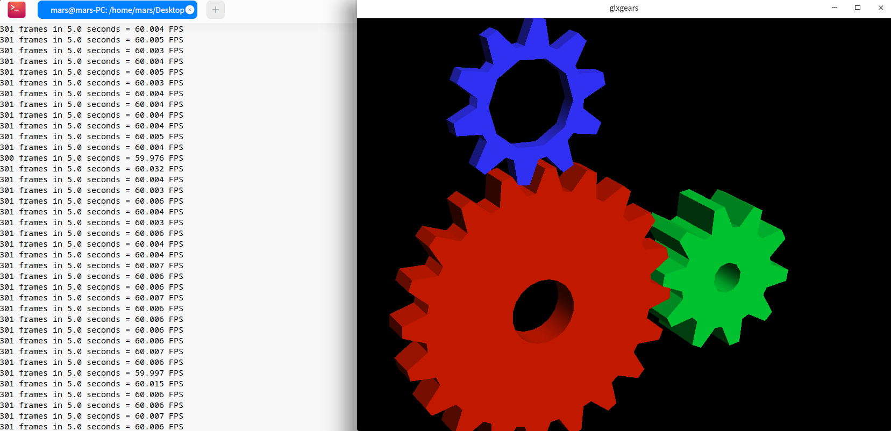
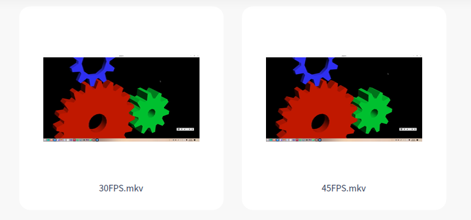
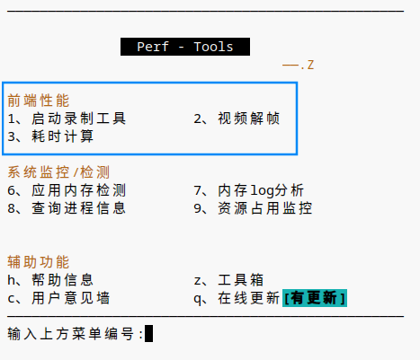
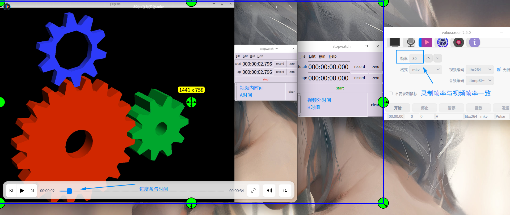

# 获取影院播放视频FPS方法

## 相关术语

| 缩写 |       全称        |     描述     |
| :--: | :---------------: | :----------: |
| FPS  | Frames Per Second | 每秒传输帧数 |

## 问题

​		目前基于Uos影院应用测试中，有一个功能点一直没覆盖到：验证影院播放视频呈现的FPS（帧率）。

​		比如影院，在播放一个50帧率的视频资源，通过显示器呈现给用户的观感是否有达到50FPS，这是目前需要解决的问题：找到对应的测试方法。

## 现状

​		针对于以上描述问题，方案分为两个方向：
 - 通过外部获取：例如FPS监控软件，直接使用FPS检查工具针对播放中视频检测FPS
 - 通过内部获取：了解影院播放功能的设计逻辑，手动计算获取，通过播放视频时，抽取视频几段位置，分别获取每帧播放完毕时的耗时，计算出平均帧率，经过验证此方法可满足当前需求。
 - 通过计算获取：获取单位时间内帧数图片与耗时，计算出当前播放帧率

​		经调研基于linux做FPS检测的工具很少，目前只找到2款工具：Unigine Heaven、GLgears，但这2款工具在FPS测试方便均是针对显卡，并不满足我们的需求（应用播放视频呈现的帧率），所以pass掉。

​		暂定使用内部获取方案与计算获取的方案，后续会进行数据比对与测试流程比对，确认最终方案。

## 技术方案

​		要通过内部获取的方案，首先需要确认目前测试部硬件环境，然后对影院FPS相关逻辑进行了解分析，最后找到对应的测试切入点。

### 测试范围

​		目前测试部搭配的显示器刷新率统一为60Hz（ 每秒钟刷新60次 ），通过字面上的意思可以得出结论：若播放80帧的视频，每一秒钟切换80张图，但是显示器每一秒才刷新60次，那么视频每一秒包含的80帧中，必然有部分帧是显示不出来的，这就是所谓的**丢帧**。所以在测试资源上目前支持测试**60FPS**以下的视频资源。

​		除了显示器以外显卡对FPS也有一定影响，比如目前我们测试机配置的显卡，针对50帧以上的4K高分辨率视频存在解码性能问题，也会影响测试结果。除开性能以外显卡有一个配置项**垂直同步**，当打开后显卡输出的FPS与显示器刷新率会一致，这个选项对用户场景来说基本是默认开启的，所以我们不考虑关闭此配置项的情况。

​		这里说一下视频播放的原理，视频播放理论由连续不断的图片切换呈现出的效果，例如在测试中所说的50帧率视频，其实就是在每一秒的时间内连续切换了50张不同的图片，每一张图片为1帧，所以FPS表现为：50帧/秒。人的肉眼在查看超过30帧的画面，在视觉感知上就较为流畅，所以视频资源最少需要达到**30FPS**。

​		结合以上内容可确定目前可测试的视频资源范围为：

* 普通视频：==30FPS-60FPS==
* 4K高清视频：==30FPS-50FPS==

### 原理确认

#### 内部获取方案（方案1）

​		遍历影院与FPS相关的功能，决定从进度条做为切入点，因为进度条递增1秒理论上就是视频FPS。通过和影院开发（谢鹏飞）沟通后了解了一些技术概念与影院内部设计逻辑，证明该方案是可行的。

​		业界对于音视频同步一般是三种策略：

|策略|详情|
| :--: | :------------------: |
| 音频和视频同步到时钟 | 以外部时钟为参考对象，视频和音频均以时钟时间为准 |
| 音频去同步视频的时间 | 以视频时间为基准，判断音频快了还是慢了，从而调整音频的播放速度，其实是一个动态的追赶与等待的过程。 |
| 视频去同步音频的时间 | 这个方案的原理刚好与方案2的原理相反。就是以音频时间为基准，判断视频是快了还是慢了，从而调整视频的播放速度。 |

​		举个例子：60FPS的视频，实际播放出来只有30FPS，那不同的同步策略会有什么不同的展示？下面能很直接看出差异：

* 正常情况下60FPS视频，实际播放达到60FPS，耗时1秒播放完60帧

* 音频去同步视频时间：耗时2秒播放完60帧

* 视频去同步音频时间：耗时1秒播放完30帧，其中30帧被丢掉

​		咱们**影院采取的同步策略为视频去同步音频时间**，所以若播放视频FPS未达到视频资源FPS，那么呈现出来的效果是：==播放过程中会丢帧==。

​		那么进度条递增1秒则代表完成了1秒的音频播放，同时完成了1秒时间内帧的播放，播放了多少帧则代表当前播放FPS，所以在后续的测试中进度条的变化时主要的参照物。

#### 计算获取方案（方案2）

​		该方案的重点在于==时间==与==帧图像==，只要能获取影院播放视频每秒消耗的时间和帧图像，即可计算出当前位置的FPS。比如30FPS的视频在播放过程中，任意截取一秒内播放的帧图像数量，并去掉重复的帧图像，最后剩余图片数量预期应该是30张，那30即为当前播放帧率。

​		该方案的难点在于怎么定位一秒的播放时长来截取该范围帧数图像。

## 关键技术

​		这两种方案中都会采用到的关键测试技术是视频分帧，它能做到把每一秒视频分解为任意数量的帧图像，通过对帧图像的分析与筛选，达到我们测试的目的。

### 视频资源

​		这两种方案都会受到视频资源的影响，比如某些视频资源本身在某一段时间画面就是静置的，则无法使用该方法进行测试，因为视频本身就有重复帧。

​		我们无法保证每个视频资源都没有重复帧，那么我们可以自己制作符合要求的视频资源，这里可使用显卡FPS测试工具glxgears，运行glxgears会产生3个不同转动的齿轮，因为开启了垂直同步所以齿轮动画稳定在60FPS，通过视频录制软件录制齿轮动画为不同FPS资源：30FPS、49FPS，这些资源作为测试数据完美解决视频本身出现重复帧的情况。

​		为了满足“计算获取帧率方案”，在录制视频时安装了一个毫秒精度的计时器==stopwatch==，录制过程中计时器会和齿轮动画同时运行，后期则通过计时器数值来定位“ 每秒 ”的范围。同时也可以印证“内部获取帧数方案”的可行性。

* glxgears运行动画及实时帧率

* 已完成录制视频资源：

* 录制的视频截图

### 视频分帧

​		视频分帧的原理是把一个录制好的视频按照一定的规则分解成图片，比如一个30FPS的视频：

* 每秒分出10帧，每秒会得到10帧不同图像
* 每秒分出30帧，每秒会得到30帧不同图像
* 每秒分出60帧，每秒会得到30帧不同图像和30帧重复图像

### 实现支撑

​		综上所述要进行测试前，需要准备以下内容：

* 测试视频资源：目前已录制了30FPS、49FPS视频资源（录制工具无法录制出60FPS视频，暂时忽略该FPS资源），已上传至seafile【成都-测试团队 / 成都-测试团队 / 测试资源 / 视频资源 / 定制FPS】

* 视频录制/图片查看工具：可通过工具‘PerfTools’辅助，首页【编号1】可自动安装视频录制、图片查看工具**（如下图）**

* 视频分帧：可通过工具‘PerfTools_3.3’辅助，3.3版本新增了自定义分帧图片数量功能，首页【编号2】。

* 影院更新至测试对应版本

* 工具截图：

* 分帧流程截图：

  

  

## 实验验证

#### 验证测试资源

​		进行实验验证前，对测试资源进行一轮验证（后续测试直接使用测试资源即可），确保测试视频资源FPS是达到标准的，因为后续无需其他测试人员再操作，该部分只展示原理与数据。

​		**重点说明：**==因为视频资源是通过录制的方式生成的，所以录制本身也可能出现丢帧的情况，以下经过验证过的时间均为正确位置，所以在之后的测试中，截取的三组数据均必须为验证后的时间位置==

​		**操作步骤简介**

* 通过测试工具PerfTools对30/49视频进行分帧，分帧图像数量与视频一致即可
  * 这里有做过分帧图像数量验证：30FPS视频分帧图像数量分别为30和60，得出的结论一致，所以这里分帧图像数量设置成视频FPS即可
* 通过计时器截取时间范围，选取三个时间区域，每个时间区域范围为“1s”，这里选择计时器做参考有2个原因：
  * 影院外计时器不受影院内部逻辑影响，对验证结果更有说服力
  * 计时器精度为毫秒级，更能体现细节
* 把多组时间区域的图像帧分别复制到对应文件目录
* 依次查看每个目录，去掉重复帧（参考图像与计时器时间，若时间未变化则为重复帧）
* 统计数据并分析，数据如下：
| 测试视频资源 |       时间区域(计时器时间)      |进度条对应时间 | 去重帧数量   |
| :--: | :---------------: | :----------: |:----------: |
| 30FPS视频  | 00:00:03.051 —— 00:00:04.053 |3s-4s | 30 |
| 30FPS视频  | 00:00:08.021 —— 00:00:09.021 |8s-9s | 30 |
| 30FPS视频  | 00:00:11.027 —— 00:00:12.026 | 11s - 12s |30 |
| 30FPS视频  | 00:00:12.026 —— 00:00:13.012 | 12s - 13s |30 |
| 30FPS视频  | 00:00:22.021 —— 00:00:23.018 |22s - 23s | 30 |
| 49FPS视频  | 00:00:05.018 —— 00:00:06.025 | 05s - 06s |49 |
| 49FPS视频  | 00:00:08.003 —— 00:00:09.000 | 08s - 09s |49 |
| 49FPS视频  | 00:00:12.002 —— 00:00:13.001 | 12s - 13s |49 |
| 49FPS视频  | 00:00:14.020 —— 00:00:15.019 |14s - 15s | 49 |
| 49FPS视频  | 00:00:20.019 —— 00:00:21.019 |20s - 21s | 49 |

​		通过以上数据验证，可看出得出的帧数量与视频测试资源FPS一致，证明以上原理可靠，在==后续的测试中，不管是【内部获取FPS方案】还是【计算获取FPS方案】使用以上时间区域即可，为了可以通用，取得时间区域都是整点==。

#### 获取监控视频

​		要获取影院播放视频呈现的FPS，首先需要在影院播放测试视频资源时，对该过程进行视频录制监控，最后再对监控视频进行分帧处理，对分解为帧图像的数据进行进一步的分析。

​		在录制视频时，同样加入了计时器==stopwatch==，用于后期数据分析，下面将录制：影院播放**测试视频资源（30FPS）**的监控视频，步骤如下：

* 关闭所有不相关应用与窗口

* 运行计时器stopwatch

* 运行影院并打开视频资源（30FPS），在00:00:00位置暂停

* 运行PerfTools工具，执行【编号1】启动视频录制软件，设置录制帧率为30，开始录制

* 影院开始播放视频、计时器开始计时

  * **注意**：鼠标移动至底部工具栏（此处为重点，因为鼠标移动至附近，进度条才不会消失，我们需要监控进度条时间变化）
  * **视频资源内**展示时间，后续称为==A时间==
  * **视频资源外**展示时间，后续称为==B时间==
  * 理论上截取1秒时间区域，通过A时间与B时间进行验证，均需等于1秒

* 影院点击播放键，

* 视频播放完毕，停止录制

  

#### 获取影院播放视频帧率

#### 视频分帧

​		下面将针对录制好的监控视频（影院播放**30FPS**测试资源）进行数据分析，得出测试结果，两种方案前期步骤一致，如下：

* 运行PerfTools工具：
  * 执行首页【编号2】
  * 执行子菜单【编号1】—— 输入监控名称 —— 输出自定义帧率**30 ** —— 完成分帧**（见插图）**
* 进入目录【监控30FPS_30fps】，说明：监控30FPS为视频名称；30fps为分帧数量，验证一致则代表视频资源分帧正确
* 右键点击图片选择使用nomacs打开（相比系统自带看图软件，切换图片更流畅）
* 根据**验证测试资源**部分时间区域，选取至少3组区域的数据，根据各自的分析方法得出FPS
* 多组数据间求平均值得出最终结果

**内部获取FPS方案（方案1）分析**

​		以下数据主要基于==进度条对应时间==得出，计时器时间A是作为一个重要参考项，==首帧与尾帧都是根据影院进度条对应时间来定位==，用第一组数据举例：

* 首帧为影院进度条变为00:00:03不在变化那一帧
* 尾帧为影院进度条变为00:00:04不在变化那一帧

​		==方案1数据：==

| 数据组 | 选取时间A范围 |时间A实际范围（首帧和帧数图像上时间）   |进度条对应时间    |首帧 |尾帧|     去重后帧数量     |
| :--: | :---------------: | :----------: |:----------: |------------ |------------ |------------ |
| 第一组  | 3s-4s |00:00:03.320 —— 00:00:04.287 |3s-4s |164 |200 |29 |
| 第二组  |12s - 13s |00:00:12.326 —— 00:00:13.346 | 12s - 13s |448 |478 |28 |
| 第三组  | 22s - 23s |00:00:22.353 —— 00:00:23.318 |22s - 23s | 748 |777 |25 |

​		通过以上数据求平均值，得出最终的FPS： （29+28+25）/3 ≈ 27.3帧

**计算获取FPS方案（方案2）分析**

​		该方案数据主要基于==进度条与时间B==得出，首先选定时间A的范围，然后在得出首/尾帧：

* 首帧：以进度条时间范围起始点定位首帧，同时获取帧图像上时间B时间，作为起始点时间

* 尾帧：以时间B起始点时间为准，起始点时间向后推1000ms，则为尾帧

​		起始点与结束点范围区间耗时为1000ms，也就是时间B的时间范围永远为1000ms（因为录制精度的问题，可能有微量误差），获取时间B尾帧时顺便记录时间A的时间，后续做参考，具体格式如下：

| 数据组 | 进度条时间范围 |时间A实际范围   |计时器时间B    |首帧 |尾帧|     去重后帧数量     |
| :--: | :--: |:---------------: | :----------: |:----------: |:----------: |:----------: |
| 第一组  |                                | | |  | | |
| 第二组  | * 已验证数据表格中进度条时间区间 | * 通过确认首/尾帧，获取图像上时间A区间 | * 进度条范围起始点 —— +1000ms | * 时间B起始点帧编号 |* 时间B结束点帧编号 | |
| 第三组  |  | | |  | | |

​		为了与**方案1**相互印证，以下选取时间A范围取值改为与方案1一致，以方案1中**时间A实际范围**的起始点为时间B的起始点，再后推1000ms获得结束点。总结一下就是，首/尾通过时间B范围确定，但是时间B的起始点是通过**方案1**的起始点确认的，这样就能保证测试的范围是同一范围，方便做数据对比分析。

​		==方案2数据：==

| 数据组 |  选取时间A范围（预期结果）   |        时间A实际范围         |         计时器时间B          | 首帧 | 尾帧 | 去重后帧数量 |
| :----: | :--------------------------: | :--------------------------: | :--------------------------: | :--: | :--: | :----------: |
| 第一组 | 00:00:03.320 —— 00:00:04.287 | 00:00:03.320 —— 00:00:04.154 | 00:00:06.292 —— 00:00:07.320 | 164  | 194  |      24      |
| 第二组 | 00:00:12.326 —— 00:00:13.346 | 00:00:12.326 —— 00:00:13.346 | 00:00:15.760 —— 00:00:16.764 | 448  | 478  |      28      |
| 第三组 | 00:00:22.353 —— 00:00:23.318 | 00:00:22.353 —— 00:00:23.318 | 00:00:25.763 —— 00:00:26.752 | 748  | 778  |      25      |

​		通过以上数据求平均值，得出最终的FPS： （24+28+25）/3 = 25.6帧

​		同时把**方案1**的数据拿下来，把**进度条对应时间**根据首/尾帧改为时间B范围，与以上**方案2**数据做进一步印证。

​		==方案1加入“时间B范围”后数据：==

| 数据组 | 选取时间A范围 | 时间A实际范围（首帧和帧数图像上时间） | 时间B范围（供对比，与首/尾帧无关） | 首帧 | 尾帧 | 去重后帧数量 |
| :----: | :-----------: | :-----------------------------------: | :--------------------------------: |  :----------: |  :----------: |  :----------: |
| 第一组 |     3s-4s     |     00:00:03.320 —— 00:00:04.287      |    00:00:06.292 —— 00:00:07.493    | 164  | 200  | 29           |
| 第二组 |   12s - 13s   |     00:00:12.326 —— 00:00:13.346      |    00:00:15.760 —— 00:00:16.764    | 448  | 478  | 28           |
| 第三组 |   22s - 23s   |     00:00:22.353 —— 00:00:23.318      |    00:00:25.763 —— 00:00:26.729    | 748  | 777  | 25           |

​		通过以上数据可以看出，第二组与第三组数据得出的结论吻合，但是第一组数据有出入，进行进一步分析如下：

* ==方案1==比==方案2==的尾帧多了6帧，经过验证这6帧中有5帧时有效帧，若方案2加5帧则数据吻合

* 通过==方案1==中时间A与时间B分析，时间A（视频内时间）耗时967毫秒，时间B（视频外自然时间）耗时1201毫秒，也就是说针对第一组数据中进度条递增1秒的耗时超过了1秒，所以尾帧要比方案2多出6帧，同时这里也证明了方案1会有存在误差的情况

* 通过==方案2==中时间A与时间B分析，时间A（视频内时间）耗时834毫秒，时间B（视频外自然时间）耗时1028毫秒，也就是说自然时间1秒内，影院只播放了834毫秒的资源，存在丢帧情况，与结果24帧吻合

## 定案

### 最终结论

​		通过以上数据分析，最终得出以下结果：

* 方案2精度更高，方案1有时会存在误差
* 方案1与方案2测试结果差距1.7帧：
  * 方案1：25.6帧
  * 方案2：27.3帧

​		最终结论是，使用方案2进行测试可解决目前面临的问题，获取影院播放视频呈现的FPS值。

​		同时需要注意的是：==真实测试时，发现这种帧率不稳定情况，可额外多做2组数据，增加精确度，同样需要在“验证测试资源部分”的表格中选择时间区域==。

#### 测试方法最终调整

​		定案使用最终方案进行测试后，有部分细节需要调整，最终流程如下：

* 获取测试资源视频（不变）：seafile【成都-测试团队 / 成都-测试团队 / 测试资源 / 视频资源 / 定制FPS】

* 获取监控视频（不变）

* 视频分帧（不变）

* 选取有效时间区域，参考==验证测试资源==部分表格中进度条对应时间区域，至少三组，若结果不稳定则酌情增加

* 分帧后图像数据处理：

  * 首帧：参考==验证测试资源==部分表格中，==进度条==对应时间，起始点为首帧（记录该帧图像上时间A、时间B）
  * 尾帧：首帧中时间B后推1000ms，有时会上下浮动，取最接近那一帧为尾帧（记录尾帧时间A、时间B）
  * 每一组图像集合==复制==到其他文件夹中，不可删除原文件（需留底）

* 重复帧处理（不变）

* 记录表格：

  | 数据组 | 进度条时间范围 | 时间A实际范围 |        时间B实际范围         | 首帧 | 尾帧 | 去重后帧数量 |
  | :----: | :------------: | :-----------: | :--------------------------: | :--: | :--: | :----------: |
  | 第一组 |     3s-4s      |               | 00:00:06.292 —— 00:00:07.493 |      |      |              |
  | 第二组 |   12s - 13s    |               | 00:00:15.760 —— 00:00:16.764 |      |      |              |
  | 第三组 |   22s - 23s    |               | 00:00:25.763 —— 00:00:26.729 |      |      |              |

* 数据分析：

  * 主要是通过时间B范围，筛选出非重复帧数量
  * 时间A是顺便记录，出现问题后用作参考，不容缺失
  * 非重复帧数量取平均值得出结果

## 参考资料

* [音视频同步原理及实现](https://blog.csdn.net/myvest/article/details/97416415 )
* [垂直同步](https://baike.baidu.com/item/%E5%9E%82%E7%9B%B4%E5%90%8C%E6%AD%A5/7263524?fr=aladdin)
* [丢帧](https://www.cnblogs.com/zhichao123/p/11676843.html)
* [显示器刷新率与FPS](https://baijiahao.baidu.com/s?id=1620464199499893560&wfr=spider&for=pc)

