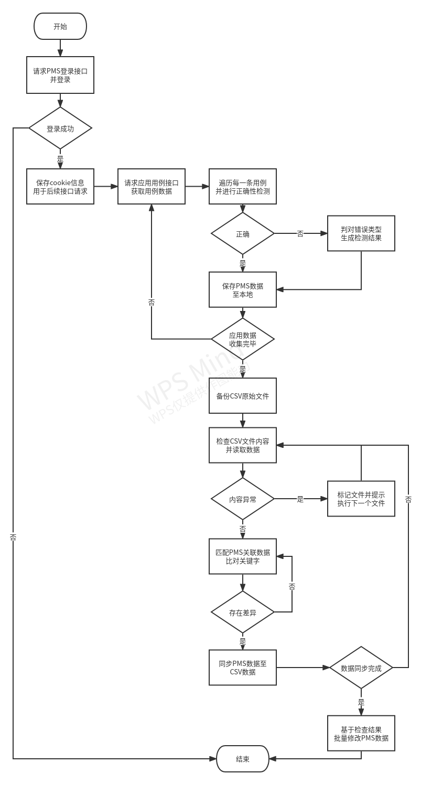
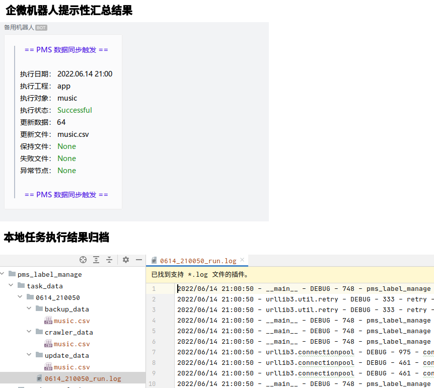
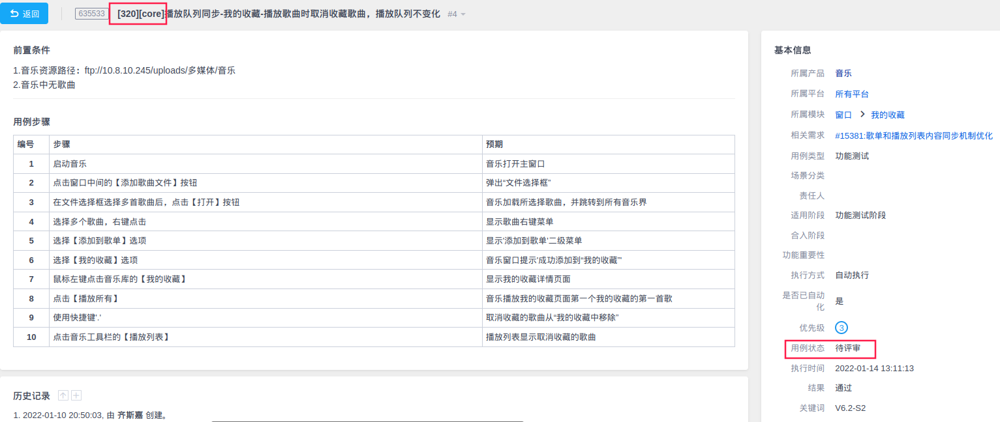
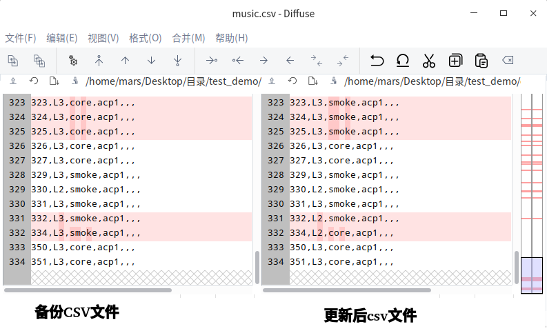
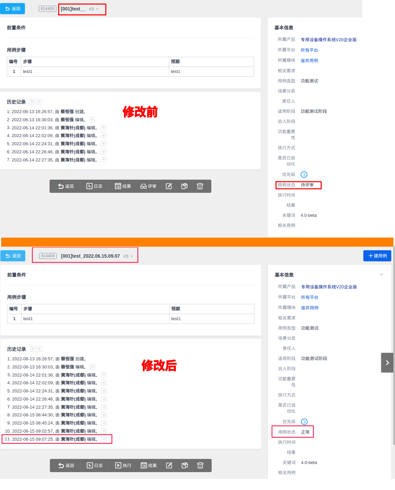

# 针对PMS用例数据检查与自动化工程CSV文件数据同步的方法调研报告

## 1 相关术语

<center>表1 相关术语说明</center>

| 缩写       | 全称                       | 描述                                                         |
| ---------- | -------------------------- | ------------------------------------------------------------ |
| PMS        | /                          | 项目管理软件，本文中主要体现在测试用例管理上。               |
| 爬虫       | /                          | 一般是基于 Python 编写的一段自动抓取互联网信息的程序，从互联网上抓取对于我们有价值的信息。 |
| CSV        | Comma-Separated Values     | 逗号分隔值文件格式，本文中该格式文件用于管理自动化测试工程测试用例。 |
| 配置化测试 | /                          | 根据不同测试场景，配置不同的用例组合情况进行测试，例如只测试核心用例，跳过其他类型用例测试。 |
| JSON       | JavaScript Object Notation | 一种轻量级的数据交换格式。                                   |
| Urllib     | /                          | Python 标准库，用于操作网页 URL，并对网页的内容进行抓取处理。 |
| Pandas     | Python data analysis       | 一个开放源码、BSD 许可的库，提供高性能、易于使用的数据结构和数据分析工具。 |
| DataFrame  | /                          | 一个表格型的数据结构，它含有一组有序的列，每列可以是不同的值类型。 |


## 2 问题

### 2.1 问题背景

​		在应用 `UI `自动化测试工程中每一个测试应用均存在一个或多个 `CSV` 文件，主要用于管理自动化测试用例，每一行数据代表一条测试用例：


<center>图1 CSV文件用例</center>

​		其中 `CSV` 文件中每一条用例都与 `PMS` 某一条用例存在关联关系，例如`图1`中用例 `id` 为1的自动化用例在 `PMS` 中展示：


<center>图2 CSV文件对应的PMS用例</center>

​		通过图1与图2可以得出两者关联关系：

>CSV 文件用例id：对应 PMS 用例标题自定义标签[001]
>
>CSV 文件用例来源：对应 PMS 用例标题自定义标签[acp1/2/3/4]
>
>CSV 文件用例标签：对应 PMS 用例标题自定义标签[core/smoke]
>
>CSV 文件用例等级：对应 PMS 用例优先级字段
>
>CSV 文件中存在的用例在 PMS 中，自动化相关的关键字需更新为：
>- 执行方式：自动化执行
>- 是否已自动化：是

​    

### 2.2 问题详情

​		为了保证用例数据的准确性，PMS 字段、标题标签需要随时更新，同时 CSV 文件数据也需要同步修改来保证数据的一致性。但目前实际项目中出现诸多更新不及时的问题：

> PMS 用例转换为自动化用例后，关键字：执行方式、是否已自动化未更新字段。
>
> PMS 用例转换为自动化用例后，未增加自动化 id 标签。
>
> PMS 用例等级发生变化后，未同步至自动化工程 CSV 文件。
>
> PMS 用例标签发生变化后，未同步至自动化工程 CSV 文件。
>
> CSV 文件删除用例后，PMS 用例信息未同步。
>
> CSV 文件新增用例后，未同步至 PMS 用例标题。
>
> CSV 文件新增标签后，未同步至 PMS 用例标题。

​		以上情况日积月累下，存在问题的用例数量会越来越多，就目前通过以上示例条件做数据筛选，得出结论存在问题数量为2000左右。其中问题数量占比与解决重心为：

* **PMS 与 CSV 两端数据不匹配 - 占比25%（重要）**：
  
  * `PMS` 已实现自动化用例，在自动化工程所需标签再变更后，未同步至自动化工程 `CSV `文件，导致影响了配置化测试的有效性，需要重点解决该问题。
  
* **PMS 用例数据/字段错误 - 占比75%（次要）**：
  
  * 除以上问题外，主要是 `PMS` 用例数据关键字、状态等不正确，不会影响自动化测试结果，但会影响手工测试与数据统计，需解决但不是那么急迫。
  * 例如用例状态未审核导致测试单无法关联、未修改自动化字段导致统计自动化用例数据错误。
  
  
  
  ​		总结本章节描述的问题核心为 `PMS` 端数据与自动化测试工程中 `CSV` 文件中数据不一致，手动修改效率太过低下，且会影响当前工作任务；若不进行处理，问题则会积累的越来越多，进入恶性循环。所以目前需要一种能够快速同步两端数据使其一致的方案。


## 3 现状

​		针对上一章节提出的问题解决流程如下：


<center>图3 解决流程</center>


​		通过流程描述，核心涉及 `PMS` 项目管理系统用例数据 与 自动化测试工程 `CSV` 文件，该 `CSV` 文件数据设计非市面上现存设计方案，为根据项目情况与需求而设计出的结构。

​		需要对两端数据进行同步，是特定场景下的需求，所以不存在现存的解决方案，基于实际情况预想了两个方向的解决方案，接下来对预想方案进行对比分析。


### 3.1 方案描述

**方案1：**

* 通过 `PMS` 功能进行批量数据获取，借助 `Excel` 进行数据分析、检查。
* 人工进行数据对比并同步差异数据至 `CSV` 文件。
* 通过本地 `Excel` 文件进行人工修改后批量上传至 `PMS`。


**方案2：**

* 通过爬虫程序进行批量数据获取，保存至本地过程中进行数据分析与检查。
* 保存完成后以应用为维度，对比双端数据，同步差异数据至 `CSV` 文件。
* 通过步骤1检查结果进行数据修改，根据项目情况可选择：
  * 导出 `PMS` 用例，根据步骤1分别对应用检查结果进行针对性用例数据修改，批量上传至 `PMS` 完成修改。
  * 根据步骤1的检查结果调用 `PMS` 用例接口，批量完成用例信息修改。


### 3.2 方案对比

​		多维度对比详情如下：

* 准备耗时
  * 方案1：手工操作+ `PMS` 项目管理工具 `WEB` 现有功能，无需准备时间
  * 方案2：需要消耗开发程序的时间
* 易用性
  * 方案1：需要了解自动化工程 `CSV` 文件设计、 `PMS` 使用方法、校验规则、同步规则
  * 方案2：需要了解程序运行参数/配置
* 高效性
  * 方案1：大部分工作依赖手工完成，用例技术越大，效率越低
  * 方案2：自动化完成，用例基数越大，效率越高
* 复用性
  * 方案1：可同时对多个应用使用
  * 方案2：可同时对多个应用使用
* 扩展性
  * 方案1：不具备扩展价值
  * 方案2：可用于其他领域，例如周期性用例质量监控。同时若后期 `PMS` 标签、`CSV` 文件设计出现增量/变化，可在原有设计的基础上进行功能扩展支持。


### 3.3 对比结论

<center>表2 方案对比</center>

|       | 准备耗时 | 易用性 | 高效性 | 复用性 | 扩展性 |
| ---- | :--: | :--: | :--: | :--: | :--: |
| 方案1 | 优 | 劣 | 劣  | 持平 | 劣 |
| 方案2 | 劣 | 优 | 优  | 持平 | 优 |

​		两套方案综合对比下来，除了方案2在前期准备耗时上处于劣势，在其他方面整体优于方案1，所以最终选择方案2。


## 4 技术方案
### 4.1 整体设计

​		方案2涉及爬虫和数据处理，首先语言定位为 `Python` 无可争议，核心库选择： `urllib` + `pandas` 的组合；核心流程为：数据获取 -> 数据清理 -> 数据检测 ->数据同步 -> `PMS` 端数据修改。

​		核心原理：

* 使用 `urllib` 进行 `PMS` 数据爬取，爬取到的数据是  `ASCII` 编码 +  `JSON` 数据格式，转换为中文。
* 制定用例检测规则与错误类型，在获取到 `PMS` 用例数据后逐一对每一条用例进行正确性检测。
* 通过 `pandas` 进行后续数据处理工作：
  * 爬虫数据设置索引、多权重排序、去重、填充空数据等，结合检测结果保存至本地。
  * `PMS` 数据与自动化工程 `CSV` 文件数据进行关键项数据抽取与比对
  * 根据比对结果，同步存在差异的数据至自动化工程 `CSV` 文件
* 通过用例检测结果，参考错误类型对 `PMS` 数据进行修改（二选一）：
  * 逐一修改后，使用 `PMS` 批量上传功能
  * 抽取问题用例，分析错误类型，使用 `PMS` 用例编辑接口回填正确数据

​		


​		**整体方案中执行流程设计方案如下：**



 <center>图4 执行流程设计方案</center>


​		工具暂命名为 `pms_label_manage`  ，整体目录结构设计如下：

```bash
  autotest-basic-frame
   ├── src 
   │   ├──pms_label_manage                    # 主目录
   │   │      ├── pms_label_manage.py         # 工具脚本
   │   │      ├── manage_config.ini		      # 工具配置文件
   │   │      ├── assist_tool.sh		      # 环境部署+运行
   |   |      ├── task_data                   # 任务数据汇总
   |   |      |     ├── 0606_0606             # 6月6日6点6分任务数据
   |   |      |     |    ├──   crawler_data   # 爬虫数据
   |   |      |     |    ├──   bakup_data     # 备份数据
   |   |      |     |    ├──   update_data    # 已更新数据
   |   |      |     |    └──   run.log        # 本次任务运行日志   
   |   |      |     └── 0608_0606             # 6月8日6点6分任务数据 
   └─  └─     └── README.md                   # 使用说明
```


​		如上文所述，工具行为通过配置文件 `manage_config` 进行管理，使其可配置性与易用性都更高。

​		以下示例为设计的配置文件爬虫部分配置项：

```ini
[run]
# 激活项目
activation_project = app,os

# 当前任务执行的项目
run_project = app

# sync(爬取pms数据并同步至本地csv)/crawler(爬取pms数据并检测)/backup(备份本地csv)/pms_fix（修正pms用例数据）
run_option = sync

# 执行任务的应用对象：all（项目下所有应用）/draw（仅执行画板）/...
run_apps = draw

# 爬取用例类型：all（全用例）/auto（仅自动化相关用例）
crawler_cases_area = auto

[csv_control]
# 需要从爬取的PMS数据中提取的数据
csv_crawler_columns = 用例id,用例等级,用例标签,用例来源,PMS编号,PMS模块,PMS标题,执行方式,自动化实现,用例状态,检测异常

# 自动化工程CSV文件关键列
csv_local_columns = 用例id,用例等级,用例标签,用例来源

# PMS与CSV数据共同索引
csv_index = 用例id

# 保存PMS爬虫数据排序权重
csv_crawler_sort = 用例id,用例等级

# PMS数据与CSV数据比对后，更新的列数据
csv_local_update =用例等级,用例标签

[pms]
# pms账号密码，用于爬取PMS数据前登录验证
pms_username = None
pms_passwd = None

[app]
# 相机应用id
camera = 110

# 截图录屏应用id
grand_search = 186

......
```


### 4.2 关键技术		

#### 4.2.1 数据爬取与检测

​		`urllib` 库是 `Python` 标准库，用于操作网页 `URL`，并对网页的内容进行抓取处理，主要对象是 `PMS `项目管理 中用例部分的内容数据。


##### 4.2.1.1 准备工作

​		需要通过抓包的方式对登录、用例接口进行了参数摸底，制定后续对应接口的请求参数，并且根据参数内容收集项目、应用在数据库中的具体 `id`。这部分内容略过，本章节主要聚焦数据爬取、检测与同步。


##### 4.2.1.2 数据爬取

​		流程是：通过 `PMS` 登录接口进行登录 -> 保存cookie信息 -> cookie放入请求头并调用用例接口 -> 获取返回数据 -> 处理数据。


###### 4.2.1.2.1 登录接口逻辑

* 设计流程为：


 <center>图5 PMS 登录流程</center>

* 实现代码：

```python
	def __init__(self, project_name, apps_name, timeout=8)
    
    	......
    
        if os.path.exists(self.ini_cf_path):
            self.username = self.ini_cf["pms"]["pms_username"]
            self.passwd = self.ini_cf["pms"]["pms_passwd"]
            if self.username == "None" or self.passwd == "None":
                self.username, self.passwd = PmsCases.__pms_login_input()
        else:
            self.last_node = "init: ini missing"
            self.__run_node_log(
                "[__init__]ini file", "配置文件缺失:pms2csv.ini", "error"
            )
            PmsCases.__error_mes("* Error: An exception occurs, interrupt tasks !")
            raise FileNotFoundError("not find file 'pms2csv.ini'")
		
        self.pms_login_url = (
            "https://pms.uniontech.com/user-login-Lw==.html"
            f"?account={self.username}&password={self.passwd}"
        )
        
        ......
        
        def pms_data_crawler(self):
        """
         爬取pms用例数据
        :return: /
        """
        print(f"\n* {self.apps_name} pms_data_crawler ...\n")
        self.__run_node_log("[pms_data_crawler]main", "主程序运行")
        try:
            self.__run_node_log("[pms_data_crawler]login", "pms登陆")
            local_response = self.get(self.pms_login_url).text
            if "登录失败" in local_response or "忘记密码" in local_response:
                self.__run_node_log(
                    "[pms_data_crawler]login user/passwd", "pms登陆失败", "error"
                )
                PmsCases.__error_mes("Error: the username or password is incorrect !")
                exit(1)
        except requests.exceptions.ConnectionError:
            self.__run_node_log("[pms_data_crawler]login network", "pms登陆失败", "error")
            PmsCases.__error_mes(
                "Error: Failed to access [PMS], check whether the network is normal !"
            )
            exit(1)

			......


	@staticmethod
    def __pms_login_input():
        """
        人机交互获取pms账号密码
        """
        local_username = input("Input pms-username:")
        local_passwd = input("Input pms-passwd:")
        if not local_username or not local_passwd:
            PmsCases.__error_mes("* Error: An exception occurs, interrupt tasks !")
            raise ValueError("pms-username/passwd is Null")
        else:
            return local_username, local_passwd
```

​		通过以上实现方案完成了 `PMS` 登录环境的内容。


###### 4.2.1.2.2 用例数据获取

​		通过用例接口调试时发现，用例接口返回数据为  `ASCII` 编码 +  `JSON` 数据格式，所以需要进行中文转换，接口返回数据如下：

```python
{"status":"success","data":"{\"title\":\"\\u4e13\\u7528\\u8bbe\\u5907\\u64cd\\u4f5c\\u7cfb\\u7edfV20\\u4f01\\u4e1a\\u7248-\\u7528\\u4f8b\",\"products\":{\"355\":\"\\u6388\\u6743\\u7ba1\\u7406\\u5e73\\u53f0\",\"347\":\"\\u72ec\\u7acb\\u4e0a\\u6e38\",\"343\":\"X86\\u4e13\\u9879\\u9002\\u914d\",\"339\":\"V23 DTK\",\"337\":\"\\u73b2\\u73d1\\u9879\\u76ee\\u4e8c\\u671f\",\"335\":\"V23 Qt\",\"333\":\"V23\\u5185\\u6838\",\"331\":\"\\u7cfb\\u7edf\\u5b89\\u5168\\u4e8c\\u671fV6\",\"329\":\"\\u7b14\\u8bb0\\u672c\",\"327\":\"\\u7edf\\u4fe1\\u670d\\u52a1\\u5668\\u64cd\\u4f5c\\u7cfb\\u7edfV20\",\"325\":\"\\u4e2d\\u6587\\u8f93\\u5165\\u6cd5V6\",\"321\":\"\\u4f01\\u4e1a\\u5fae\\u4fe1\",\"313\":\"\\u539f\\u5b50\\u66f4\\u65b0\",\"311\":\"UOS Ready\",\"301\":\"\\u8f6f\\u4ef6\\u81ea\\u4e3b\\u9002\\u914d\\u5de5\\u5177\",\"295\":\"\\u7edf\\u4fe1\\u6709\\u89c4\\u8fd0\\u884c\\u73af\\u5883\",\"289\":\"\\u684c\\u9762\\u4e13\\u4e1a\\u7248V23\",\"11\":\"\\u684c\\u9762\\u4e13\\u4e1a\\u7248V20\",\"89\":\"\\u684c\\u9762\\u64cd\\u4f5c\\u7cfb\\u7edf\\u793e\\u533a\\u7248V20\",\"4\":\"\\u670d\\u52a1\\u5668\\u64cd\\u4f5c\\u7cfb\\u7edfV20\\uff081xxxd\\uff09\",\"82\":\"\\u670d\\u52a1\\u5668\\u64cd\\u4f5c\\u7cfb\\u7edfV20\\uff081xxxa\\uff09\",\"108\":\"\\u670d\\u52a1\\u5668\\u64cd\\u4f5c\\u7cfb\\u7edfV20\\uff081xxxe\\uff09\"

...... 
 
 \"needconfirm\":false,\"bugs\":0,\"results\":\"1\",\"caseFails\":0,\"stepNumber\":\"1\"}},\"branch\":0,\"branches\":{\"0\":\"\\u6240\\u6709\\u5e73\\u53f0\",\"110\":\"aarch64\",\"111\":\"x86_64\",\"112\":\"mips64\",\"113\":\"sw_64\",\"114\":\"loongarch(3A5000)\"},\"suiteList\":{\"317\":{\"id\":\"317\",\"product\":\"107\",\"name\":\"\\u4e13\\u7528\\u8bbe\\u59071021-\\u955c\\u50cf-\\u65b0\\u9700\\u6c42\\u5168\\u7528\\u4f8b\",\"desc\":\"\\u5bf91021\\u7cfb\\u7edf\\u6240\\u6709\\u65b0\\u9700\\u6c42\\u7528\\u4f8b\\u521b\\u5efa\\u5957\\u4ef6\",\"type\":\"public\",\"addedBy\":\"ut001652\",\"addedDate\":\"2022-04-11 10:16:14\",\"lastEditedBy\":\"ut001652\",\"lastEditedDate\":\"2022-05-12 15:29:41\",\"deleted\":\"0\"}},\"suiteID\":0,\"setModule\":true}","md5":"27fc9cc5fb6c203a28b225207f328d7f"}
```

​		除此之外还发现 `JSON`  数据格式不规范，例如上述数据中 `\"setModule\":true`  缺少引号，这类问题均需要处理。

​		因为每次任务并非都是单一应用，存在同时同步10多个应用的场景，所以在数据获取这一阶段设计流程为：根据任务应用列表建立循环 -> 每次循环爬取一个应用的数据 -> 数据编码转换为 中文 -> 处理 `JSON` 数据格式问题 -> 执行下一次循环应用数据爬取。

​		部分关键实现代码如下：

```python
@staticmethod
def unicode_to_cn(in_str):
    """
    修改数据并进行编码解码操作，以完成u码转中文
    """
    local_in_str_replace = (
        in_str.replace(r"\"", '"')
            .replace(r"\/", "/")
            .replace(r"\\u", r"\u")
            .replace(r"\\n", "")
            .replace(r"\\r", "")
    )
    # local_out = None
    if isinstance(local_in_str_replace, bytes):
        local_temp = str(local_in_str_replace, encoding="utf-8")
        local_out = local_temp.encode("utf-8").decode("unicode_escape")
    else:
        local_out = local_in_str_replace.encode("utf-8").decode("unicode_escape")
    return local_out

	def pms_data_crawler(self):
		if os.path.exists(self.crawler_dir):
			pass
        else:
            os.makedirs(self.crawler_dir)
        for local_app_name in self.apps_name:
            if self.ini_cf.has_section(local_app_name):
                for local_module_name, local_module_id in self.ini_cf.items(
                    local_app_name
                ):
                    local_module_file_path = os.path.join(
                        self.crawler_dir, local_module_name + ".csv"
                    )
                    try:
                        local_response = self.get(
                            f"https://pms.uniontech.com/"
                            f"testcase-browse-{self.ini_cf[self.project_name][local_app_name]}"
                            f"-0-bymodule-{local_module_id}-id_desc-0-10000-1.json"
                        )
                        local_pms_json = (
                            PmsCases.__unicode_to_cn(local_response.text)
                            .replace('"data":"{', '"data":{')
                            .replace('","md5"', ',"md5"')
                            .replace(":null", ':"null"')
                            .replace(":true", ':"true"')
                            .replace(":false", ':"false"')
                        )
                        self.__crawler_save_csv(local_pms_json, local_module_file_path)
                    except requests.exceptions.ConnectionError:
                        print(
                            "Error: Failed to access [PMS], check whether the network is normal !"
                        )
                        exit(1)
            else:
                try:
                    local_app_file_path = os.path.join(
                        self.crawler_dir, local_app_name + ".csv"
                    )
                    local_response = self.get(
                        f"https://pms.uniontech.com/"
                        f"testcase-browse-{self.ini_cf[self.project_name][local_app_name]}-0-"
                        f"bymodule-0-id_desc-0-10000-1.json"
                    )
                    local_pms_json = (
                        PmsCases.__unicode_to_cn(local_response.text)
                        .replace('"data":"{', '"data":{')
                        .replace('","md5"', ',"md5"')
                        .replace(":null", ':"null"')
                        .replace(":true", ':"true"')
                        .replace(":false", ':"false"')
                    )
                    self.__crawler_save_csv(local_pms_json, local_app_file_path)
                except requests.exceptions.ConnectionError:
                    print(
                        "Error: Failed to access [PMS], check whether the network is normal !"
                    )
                    exit(1)
        print(f"\n* {self.apps_name} pms_data_crawler successfully !\n")
        self.__run_node_log("[pms_data_crawler]main", "主程序结束")
```


###### 4.2.1.2.3 数据检测

​		通过以上数据获取与处理后，成功的把数据转换成了中文，下面截取数据中某一条用例数据信息做展示：

```json
{
    "cases":{
        "815041":{
            "id":"815041",
            "product":"107",
            "branch":"0",
            "lib":"0",
            "module":"61219",
            "path":"0",
            "story":"16661",
            "storyVersion":"1",
            "title":"应用自启配置：镜像验证，验证同时配置多个应用全屏自启动功能正确",
            "precondition":"1. 已载入镜像2. 已获取超级管理员权限",
            "keywords":"4.0-beta",
            "pri":"3",
            "type":"feature",
            "stage":"feature",
            "howRun":"",
            "scriptedBy":"",
            "scriptedDate":"0000-00-00",
            "scriptStatus":"",
            "scriptLocation":"",
            "status":"normal",
            "subStatus":"",
            "color":"",
            "frequency":"1",
            "order":"0",
            "openedBy":"ut001214",
            "openedDate":"2022-06-13 17:00:39",
            "reviewedBy":"ut001214",
            "reviewedDate":"2022-06-14",
            "lastEditedBy":"ut001214",
            "lastEditedDate":"2022-06-14 11:36:28",
            "version":"2",
            "linkCase":"",
            "fromBug":"0",
            "fromCaseID":"0",
            "fromCaseVersion":"0",
            "deleted":"0",
            "lastRunner":"",
            "lastRunDate":"0000-00-00 00:00:00",
            "lastRunResult":"",
            "baseline":"",
            "important":"",
            "execution":"",
            "isAutomation":"",
            "scenes":"default",
            "responsible":"",
            "storyTitle":"配置开机启动应用是否全屏运行",
            "needconfirm":"false",
            "bugs":0,
            "results":0,
            "caseFails":0,
            "stepNumber":"4"
        }
    }
}
```

​		通过以上 `JSON` 数据可以看出，爬取的用例信息较为完整，已全面覆盖自动化工程 `CSV` 文件字段，并且其他更加丰富的信息可以用作用例正确性检查。

​		根据项目实际情况调研，一共制定了以下用例检测的错误类型：

```
        # 错误检查类型
        local_error_1 = "E1. [L1]等级用例未标记[acp]标签"
        local_error_2 = "E2. [core/smoke]标记用例未标记[acp]标签"
        local_error_3 = "E3. [auto_id]标签用例PMS字段设置错误:执行方式/是否实现自动化"
        local_error_4 = "E4. PMS用例状态未审核通过，无法关联测试单"
        local_error_5 = "E5. 已实现自动化，但执行方式 != 自动执行"
        local_error_6 = "E6. 已实现自动化，但标题缺少[auto_id]标签"
        local_error_7 = "E7. Auto工程本地csv文件不存在该用例id"
        local_error_8 = "E8. CSV用例id标签在PMS不存在"
```

​		根据上文制定的错误类型设计不同的判断条件，如下方部分代码：

```python
local_error_mes = ""

if local_auto_pri == "L1" and local_auto_source is None:
    local_error_mes = local_error_mes + local_error_1 + "\n"
    
if local_auto_label is not None and local_auto_source is None:
    local_error_mes = local_error_mes + local_error_2 + "\n"
    
if local_auto_id_list[0] != 0 and (local_case_execution != "自动执行" or local_case_auto != "是"):
    local_error_mes = local_error_mes + local_error_3 + "\n"
    
if local_case_status != "正常":
    local_error_mes = local_error_mes + local_error_4 + "\n"
    
if local_case_auto == "是" and local_auto_id_list[0] == 0:
    local_error_mes = local_error_mes + local_error_5 + "\n"
    
if local_case_auto == "是" and local_case_execution != "自动执行":
    local_error_mes = local_error_mes + local_error_6 + "\n"
```

​		通过以上代码可看出，每解析一条用例就能通过用例的各个字段对用例进行检测，当存在异常时输出对应错误项文案至列：`检测异常`，用于辅助后续的 `PMS` 数据修改。


#### 4.2.2 数据同步

​		使用 `pandas` 对 `PMS` 数据数据做进一步处理，并进行数据比对与同步：


##### 4.2.2.1 PMS数据处理

* 把从标题中提取出的自动化用例 `id` 设置为索引。

* 根据索引列进行排序，基于配置文件中权重 `csv_crawler_sort = 用例id,用例等级` ，优先基于用例 `id` 升序排列，用例 `id` 相同时则基于用例等级做二次升序排序。

```python
df.sort_values(by=self.ini_cf["csv_control"]["csv_crawler_sort"].split(","), inplace=True)
```

* 基于索引列去重，仅保留排序在前的用例行数据（此处理是因为目前自动化测试用例存在关联多条 `PMS` 用例的情况，`CSV` 文件保留优先级高的用例数据作为同步对象）。

* 基于配置项 `ecsv_local_update`  提取 `PMS` 用例数据为 `DataFram` 类型的二维数据表。


​	二维数据表输出：

```python
/usr/bin/python3.7 /home/mars/Desktop/test_demo/pandas.py

     用例id 用例等级   用例标签  用例来源 持续集成       跳过原因     确认跳过
0       1     L1      core     acp1   CRP             NaN        NaN
1       2     L1      smoke    acp1   CRP             NaN        NaN
2       3     L2      core     acp1   CRP             NaN        NaN
3       4     L3      core     acp1   CRP             NaN        NaN
4       5     L1      smoke    acp1   CRP             NaN        NaN
..     ...   ...      ...      ...    ...             ...        ...
407   427     L3      core     acp1   CRP       skip-方法有误     NaN
408   428     L2      core     acp1   CRP       skip-方法有误     NaN
409   429     L3      core     acp1   CRP       skip-方法有误     NaN
410   450     L2      core     acp1   CRP             NaN        NaN
411   460     L2      core     acp1   CRP       skip-方法有误     NaN

[412 rows x 7 columns]
```


##### 4.2.2.2 本地 CSV 文件备份

​		备份本地 `CSV` 文件，以便于数据回溯与回滚，备份过程当中发现 `csv` 文件存在格式错误与用例 `id` 编号类型不一致的问题（ `int` / `float` ），所以这里增加了格式检测与数据类型统一的处理，实现代码如下：

```python

	......
    
					# 检测csv文件内容格式
                    self.__run_node_log(
                        "[project_data_backup]backup",
                        f"原始csv数据-id数据类型检测: {local_csv_init_filename}",
                    )
                    if backup_df[self.csv_dataframe_index].dtypes == "float64":
                        self.__run_node_log(
                            "[project_data_backup]backup",
                            f"原始csv数据-id数据类型转换-浮点转整形, 另存文件{local_csv_init_filename}",
                        )
                        df1 = (
                            backup_df.dropna(axis=0, subset=[self.csv_dataframe_index])
                            .drop_duplicates(subset=self.csv_dataframe_index)
                            .reset_index(drop=True)
                        )
                        df1[self.csv_dataframe_index] = df1[
                            self.csv_dataframe_index
                        ].astype(int)
                        df1.to_csv(local_csv_to_backup_path, index=False)
                    elif backup_df[self.csv_dataframe_index].dtypes == "object":
                        self.__run_node_log(
                            "[project_data_backup]backup",
                            f"原始csv数据-id数据类型报错-存在字符串, 跳过该文件处理{local_csv_init_filename}",
                        )
                        self.skip_list.append(
                            local_csv_init_filename + "(id类型!=int/float)"
                        )
                    elif backup_df[self.csv_dataframe_index].dtypes == "int64":
                        self.__run_node_log(
                            "[project_data_backup]backup",
                            f"原始csv数据-id数据类型正确-int64, 另存文件{local_csv_init_filename}",
                        )
                        df1 = (
                            backup_df.dropna(axis=0, subset=[self.csv_dataframe_index])
                            .drop_duplicates(subset=self.csv_dataframe_index)
                            .reset_index(drop=True)
                        )
                        df1.to_csv(local_csv_to_backup_path, index=False)
                    else:
                        e_type = backup_df[self.csv_dataframe_index].dtypes
                        self.__run_node_log(
                            "[project_data_backup]backup",
                            f"原始csv数据-id数据类型报错-{e_type}, 跳过该文件处理{local_csv_init_filename}",
                        )
                        self.skip_list.append(
                            local_csv_init_filename + "(id类型!=int/float)"
                        )
                except pd.errors.ParserError as p:
                    # csv数据格式错误的文件处理
                    self.skip_list.append(local_csv_init_filename + "(内容格式错误)")
                    self.__error_mes(
                        f"Warning: {local_csv_init_filename} - data format error, skip the process ！ "
                    )
                    self.__run_node_log(
                        "[project_data_backup]backup",
                        f"原始csv数据-内容格式错误-{repr(p)}, 跳过该文件处理 {local_csv_init_filename}",
                        "error",
                    )
            else:
                # 本地auto项目不存在备份文件处理
                # 更新: 增加至跳过列表，不中断同步
                self.__run_node_log(
                    "[project_data_backup]backup",
                    f"本地apps目录下不存在文件: {local_csv_init_filename}, 跳过该文件处理",
                    "error",
                )
                self.skip_list.append(local_csv_init_filename + "(文件缺失)")
```

​		通过以上代码完成了两个目的：

* 检测 `CSV` 文件格式，若出现异常则跳过，并在终端给出提示，推动维护人员进行修改。
* 检测 `CSV` 文件用例 `id` 字段的数据类型，自动完成修改，达成文件标准统一化。


##### 4.2.2.3 PMS 数据与本地 CSV 数据同步

* 本地 `CSV` 文件数据提取为 `DataFrame` 数据表，并与 `PMS` 数据设置相同列索引`用例id`。

* 基于本地 `CSV` 数据索引进行循环，同时获取两张数据表数据并进行需更新列的比对。

* 同步对比不相等的值至本地 `CSV` 文件。


​		部分代码如下：

```python
# 循环索引数据处理
for local_crawler_index_num in range(local_df_crawler_end_index):
    
    # 更新数据
    local_crawler_id_value = local_df_crawler_end.loc[local_crawler_index_num, self.csv_dataframe_index]
    if local_crawler_id_value in local_update_id_list:
        
        # 比对数据行获取
        local_tem_df1 = str(local_df_update.loc[local_df_update[self.csv_dataframe_index] == local_crawler_id_value, self.csv_update_list].to_string(index=False))
        local_tem_df2 = str(local_df_crawler_end.loc[local_df_crawler_end[self.csv_dataframe_index] == local_crawler_id_value, self.csv_update_list].to_string(index=False))
        
        # 数据同步
        if local_tem_df1 != local_tem_df2:
            self.update_num += 1
            local_df_update.loc[local_df_update[self.csv_dataframe_index] == local_crawler_id_value, self.csv_update_list] = local_df_crawler_end.loc[local_df_crawler_end[self.csv_dataframe_index] == local_crawler_id_value, self.csv_update_list].values
```

​		上方代码循环执行完毕后，代表本地 `CSV` 文件数据已经在本地同步完成。

##### 4.2.2.4 完成数据同步

​		提交 `CSV` 文件修改至云端仓库，完成最终的数据修改。


#### 4.2.3 PMS数据修改

​		基于 `PMS` 数据的检测结果，参考用例对应的错误类型，进行 `PMS` 数据修改。由于在爬取的 `PMS` 数据中存在`PMS用例编号` 可轻松在 `PMS` 上定位问题用例，根据项目情况选择 `PMS` 批量上传修改或 `PMS` 接口回填均可。


#### 4.2.4 任务结果收集

​		任务完成后设计输出两类结果：

* 提示性汇总结果：通过企业微信机器人实现，同步执行任务相关信息与结果，预期示例如下

  >执行日期： 2022.06.13 15:34
  >执行工程： app
  >执行对象： music,draw
  >执行状态： Successful
  >更新数据： 68
  >更新文件： music.csv
  >保持文件： draw.csv
  >失败文件： None
  >异常节点： None

* 本地归档结果：

  > PMS爬取数据文件
  >
  > 自动化工程备份CSV文件
  >
  > 数据更新后CSV文件
  >
  > 程序运行日志


#### 4.2.5 程序运行入口

​		该工具暂命名为 `pms_label_manage` ，根据程序功能设计运行参数为：

```python
amd@huanghaizhen:~$ python3 pms_label_manage.py -h

usage: pms_label_manage [options]

PMS用例数据处理工具: 爬取PMS用例数据, PMS用例错误检测, 备份本地CSV文件,同步PMS用例标签至本地CSV文件.

optional arguments:
  -h, --help            show this help message and exit
  
  -p PROJECT, --project PROJECT
                        应用项目: os(基于cd-uosdevice-os)/app(基于autotest-basic-frame)/other(扩展工程 - 后续自定义添加)

  -o OPTION, --option OPTION
                        应用选项: sync(爬取pms数据并同步至本地csv)/crawler(爬取pms数据)/backup(备份本地csv)
                        
  -a APPS, --apps APPS  应用范围: all(所有应用)/music(音乐)/draw...

例如爬取音乐pms数据: python3 pms_label_manage.py -o crawler -p app -a music
```


​		为了保证易用性，根据使用环境设计了两种启动方式：

* `Shell` 脚本运行 （无需完成环境部署）- `assist_tool.sh`，命令行进行：
* 命令行运行：`bash assist_tool.sh run` —— 【环境部署 + 以配置文件默认配置运行】。
  * 交互式运行：`bash assist_tool.sh`，展示菜单引导用户配置（图5）—— 【以用户选择引导菜单项运行】
* `Python` 脚本运行（已完成环境部署）- `pms_label_manage.py`，命令行进行：
* 直接运行： `python3 pms_label_manage.py`  —— 【以配置文件默认配置运行】
  * 参数运行： `python3 pms_label_manage.py -p app -o crawler -a music`  —— 【以参数自定义运行】


<center>图6 Shell交互式运行</center>


## 5 实验验证

​		**实验环境**

> 【硬件环境】
> 设备架构：x86_64
> 设备处理器：处理器 : Intel(R) Core(TM) i7-10700 CPU @ 2.90GHz (八核 / 十六逻辑处理器)
> 主板 : B460M-HDV(RD)
> 内存 : 8GB(TMKU8G68AHFHC-26V DDR4 2667MHz (0.4ns))
> 存储设备 : ESO256GMFCH-E3C-2 (256 GB)/x796w (31.0 GB)/WDC WD10EZEX-08WN4A0 (1.00 TB)
> 网络适配器 : Ethernet Connection (12) I219-V/Ethernet interface/Ethernet interface
>
> 【软件环境】
>pandas版本：1.3.0
> Python版本：3.7


​		**实验流程**


 <center>图7 实验流程</center>


### 5.1 任务启动

​		以同步应用 `deepin-music` 为例，执行环境部署与任务启动命令：

```bash
$ bash assist_tool.sh setup
$ python3 -p app -o music -a all
```

​		

### 5.2 任务完成

​		等待任务完成，查看任务结果：



 <center>图8 任务执行结果</center>

### 5.3 查看用例检测结果

​		任务执行结果归档文件中查看 `PMS` 数据检测结果：


 <center>图9 PMS数据本地CSV文件</center>

​		进一步验证有效性，查看 `PMS` 项目管理工具 `WEB` 端数据，抽取`用例编号：635533` 用例进行验证：



 <center>图10 PMS在线用例数据</center>

​		通过以上在线数据验证可看出，该用例`缺少[acp]标签`且`用例状态非正常`，与 `CSV` 文件中检查异常结果一致。	

### 5.4 数据备份与同步

​		检查备份文件与同步更新后文件差异性：



 <center>图11 同步前后差异性对比</center>

​		进一步验证有效性，查看 `PMS` 项目管理工具 `WEB` 端数据，抽取以上`323行 - 325行` 数据验证：


 <center>图12 PMS在线用例数据-标题</center>

​		验证结果通过，可看到 `PMS` 在线数据最新标签确认为 `[smoke]` ，且本地 `CSV` 文件中替换`[core]` 标签正确。


### 5.5 PMS数据批量修改

​		本环节存在两种子方案：

* [1] `PMS` 批量上传修改

* [2] 通过用例编辑接口批量回填修改用例数据


​		因子方案[1]是手工+ `PMS` 管理平台本身支持的功能，这里不再做验证。以下主要针对子方案[2]的可行性做验证，以下为利用 `PMS` 用例编辑接口回填的数据 `DEMO`：

```python
import requests

login_url = "https://pms.uniontech.com/user-login-Lw==.html?account=&password="
case_fix = "https://pms.uniontech.com/testcase-edit-814409.html"

data = {
'title': f'[001]test_{time.strftime("%Y.%m.%d.%H.%M", time.localtime())}',
'steps[1]': 'test1',
'stepType[1]': 'step',
'expects[1]': 'test1',
'files[]': '(binary)',
'uid': '62a89acf7dd13',
'product': '107',
'branch': '0',
'module': '33344',
'type': 'feature',
'scenes': 'default',
'stage[]': 'feature',
'pri': '3',
'status': 'normal',
'keywords': '4.0-beta'
}

s = requests.session()
# 登陆
s.get(url=login_url)
# 编辑用例
s.post(case_fix, data=data)

# 打印修改内容与请求响应信息
print("fix:\n", f"title: {data['title']}\n", f"status: {data['status']}\n")
print("status_code:", r1.status_code, "\nresponse:", r1.text)
```

​		以上 `DEMO` 主要针对 `PMS` 用例编号为814409的用例，收集 `PMS` 该用例历史数据，运行 `DEMO`  ：

```bash
$ python3 DEMO.py

fix:
 title: [001]test_2022.06.15.09.07
 status: normal

status_code: 200 
response: <html><meta charset='utf-8'/><style>body{background:white}</style><script>parent.location='/testcase-view-814409.html';

</script>
```

​		收集 `PMS` 修改的新用例数据与历史数据做对比：



 <center>图13 调用 PMS 用例编辑接口修改数据前后对比图</center>

​		通过修改后数据可看出：

* 标题内容修改成功，与运行 `DEMO` 后打印的修改信息一致
* 用例状态修改成功，从`待评审`扭转为`正常`
* 修改历史记录时间验证，与标题时间一致


### 5.6 验证结果

​		通过 5.1 - 5.7 小结的验证，可确认该方案可行性通过，同时简单计算效率提升，同样以音乐应用  +  `PMS` 数据同步 `CSV` 文件场景为例：


#### 5.6.1 历史方案耗时

​		通过视频录制的方式采集耗时:

* [1阶段] 获取 `PMS` 数据，操作+浏览器响应耗时 -  30 秒：

  * 启动浏览器 - 8秒。
  * 登录 `PMS` - 切换项目至应用用例部分 - 15秒
  * 导出所有用例数据至本地  - 7秒。

* [2阶段] 校验数据差异，并更新 `CSV` 文件耗时 - 20秒（数据需同步）/18秒（数据无需同步）：

  * 同时打开 `PMS` 导出文件与自动化 `CSV` 文件 - 6秒。

  * 按照 `CSV` 文件中用例id的值，在 `PMS` 导出文件标题列进行查找 - 10秒

  * 根据查找结果校验 `CSV` 文件对应用例数值是否一致：

    * [2-1阶段] 存在差异则进行修改 - 4秒
    * [2-2阶段] 不存在差异略过 - 2秒

* 耗时计算：

  > 目前音乐自动化-用例总数量：351
  > 目前音乐自动化-修改用例数量：64
  > 计算公式：[1阶段]耗时 + （用例总数量-修改用例数量）* [2阶段]数据无需同步耗时 + 修改用例数量* [2阶段]数据需同步耗时

  计算耗时结果（秒）：30 + 5166 + 1280 = 6476


#### 5.6.2 新方案耗时

​		在任务 `DEMO` 运行代码前后加上时间打印并运行：

```bash
$ python3 pms_label_manage.py -p app -o sync -a music

start time: 2022.06.15.10.00.03

* {'music'} pms_data_crawler ...

* {'music'} pms_data_crawler successfully !

* {'music'} project_data_backup ...

* {'music'} project_data_backup successfully !

* {'music'} project_data_update successfully !

* task successfully !

end time: 2022.06.15.10.00.10
```


​		耗时计算公式：`end time - start time`。

​		计算耗时结果（秒）：10 - 3 = 7


#### 5.6.3  耗时数据对比

| 历史方案耗时（秒） | 新方案耗时（秒） | 差异值（秒） |
| ------------------ | ---------------- | ------------ |
| 6476               | 7                | 6469         |

​		根据以上数据可看出，在效率上新方案超出历史方案很多，通过计算现计算具体数值：

* 计算公式：`（历史方案耗时-新方案耗时）/新方案耗时`。

* 计算结果：（6476-7）/7 = 924.14。

  通过以上公式得出最终结论，采用新方案比历史方案提升效率 924.14 倍。


### 5.7 稳定性验证

​		基于 5.1 - 5.4 章节主流程进行稳定性测试，连续运行30次之后对运行过程与结果进行验证，基于 5.1 - 5.4 章节描述的验证方法进行结果如下（因之前详细展示过验证方法与流程，此处仅展示结论）：

* 运行过程：未出现报错。

* 运行结果：

  * 提醒数据：正常。
  * 归档数据：正常

  基于验证结果可得出结论，该方案运行较为稳定。


## 6 小结

​		根据实验验证章节内容，可得出结论采用方案可行性通过。运行应用除了参数运行外还加入了 `Shell` 可视化菜单，可根据提示运行，大大增加了易用性。除此之外在实验验证最后阶段，基于任务 `PMS` 用例数据同步至自动化工程 `CSV` 文件，通过计算得出效率的提示在924倍左右，虽然仅使用音乐进行数据收集，但在其他应用上套用该计算公式同样适用。

​		结合项目实际情况与问题阶段提出的问题重要程度，目前优先解决 `PMS` 与 `CSV` 两端数据不匹配问题，也就是说只实现 `PMS` 用例数据同步至自动化工程 `CSV` 文件部分功能，下一步演进项定为：

1. 解析 `PMS` 检测异常用例数据，利用 `PMS` 用例编辑接口进行内容回填，根据异常类型修改为正确数据。
2. 因考虑开发周期问题，选用了较为成熟的数据处理库 `pandas` ，但该库体量较大，后续考虑基于`csv` 标准库重新实现应用功能，减少依赖。
3. 后续建立类似定时任务/流水线的运行机制，周期性触发应用，达到持续保证用例数据质量的目的。


## 7 参考资料

[Urllib 标准库使用](https://www.runoob.com/python3/python-urllib.html)

[Pandas 数据分析](https://www.runoob.com/pandas/pandas-tutorial.html)

